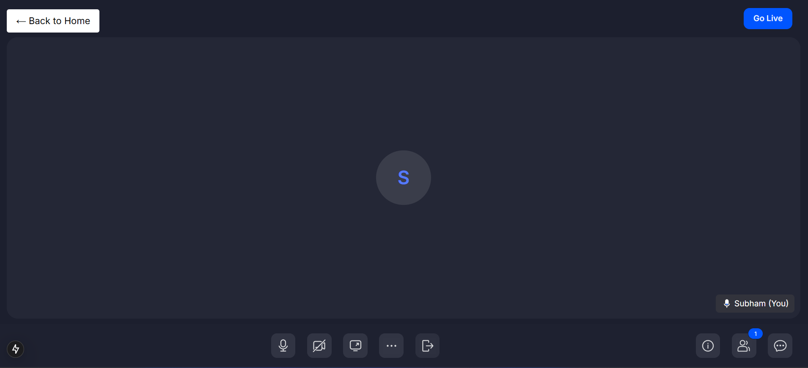

# NextJS Live Stream with ZegoCloud

[](https://opensource.org/licenses/MIT)

A minimalist yet powerful live streaming platform built with Next.js 14 and ZegoCloud SDK, enabling real-time video streaming with a beautiful user interface.

## 📋 Table of Contents

- [Overview](#overview)
- [Features](#features)
- [Screenshots](#screenshots)
- [Tech Stack](#tech-stack)
- [Prerequisites](#prerequisites)
- [Installation](#installation)
- [Configuration](#configuration)
- [Usage](#usage)
- [Project Structure](#project-structure)
- [Workflow](#workflow)
- [Workflow Diagram](#workflow-diagram)
- [Learnings](#learnings)
- [Contributing](#contributing)
- [License](#license)

## 🚀 Overview

This project creates a seamless live streaming experience powered by Next.js and ZegoCloud's UIKit. With its streamlined approach, users can quickly create or join streaming rooms with minimal setup. The integration of ZegoCloud's SDK enables low-latency, high-quality streaming while Next.js provides a performant, responsive frontend.

## ✨ Features

- **One-Click Stream Creation**: Generate a new streaming room instantly
- **Simple Room Joining**: Join existing streams with just a room ID
- **Role-Based Access**: Participate as host, co-host, or audience member
- **Real-time Chat**: Built-in chat functionality for viewer interaction
- **Responsive Design**: Beautiful UI that works across all devices
- **Minimal Authentication**: Quick name-based access without complex registration
- **Sharable Room Links**: Easy link sharing for inviting viewers and co-hosts

## 📸 Screenshots

### Home Page


### Stream Creation


### Live Streaming Interface


### Mobile View


### Chat Interface


## 🛠️ Tech Stack

- **Frontend Framework**: Next.js 14 (App Router)
- **UI Styling**: TailwindCSS
- **Streaming SDK**: ZegoCloud UIKit Prebuilt
- **State Management**: Zustand
- **Deployment**: Vercel (recommended)

## 📋 Prerequisites

Before you begin, ensure you have the following:

- Node.js (v18.x or later)
- npm or yarn
- ZegoCloud account with API credentials

## 📥 Installation

1. Clone the repository:

```bash
git clone https://github.com/yourusername/nextjslivestream-zegocloud.git
cd nextjslivestream-zegocloud
```

2. Install dependencies:

```bash
npm install
# or
yarn install
```

3. Create a `.env.local` file in the root directory with the following variables:

```env
# ZegoCloud
NEXT_PUBLIC_ZEGO_APP_ID=your_zego_app_id
NEXT_PUBLIC_ZEGO_SERVER_SECRET=your_zego_server_secret
```

4. Make sure to create the images directory structure:

```bash
mkdir -p public/images/screenshots
```

5. Add your screenshot images to the `public/images/screenshots` directory.

## ⚙️ Configuration

### ZegoCloud Setup

1. Create an account at [ZegoCloud Console](https://console.zegocloud.com/)
2. Create a new project and obtain your AppID and ServerSecret
3. Configure project permissions (ensure live streaming is enabled)
4. Add the credentials to your `.env.local` file

## 🚦 Usage

### Starting the Development Server

1. Run the development server:

```bash
npm run dev
# or
yarn dev
```

2. Open [http://localhost:3000](http://localhost:3000) in your browser.

### Creating a New Stream

1. Enter your name in the input field on the homepage
2. Click the "Create New Stream" button
3. You'll be taken to your stream room with host controls
4. Share the generated room URL with potential viewers

### Joining an Existing Stream

1. Enter your name in the input field on the homepage
2. Enter the room ID in the "Room ID" field
3. Click the "Join Stream" button
4. You'll join the stream as an audience member

### Inviting Others

As a host or co-host, you can invite others by sharing links:
- For co-hosts: `https://your-domain.com/room/[roomid]?role=Cohost`
- For audience: `https://your-domain.com/room/[roomid]?role=Audience`

### Streaming Controls

- **Host/Co-host**: Full control panel with camera, microphone, screen sharing options
- **Audience**: View stream and participate in chat
- **All users**: Use the "Back to Home" button to return to the homepage

## 📂 Project Structure

```
├── app/                  # Next.js 14 App Router
│   ├── room/[roomid]/    # Dynamic room route 
│   └── page.tsx          # Home page with join/create interface
├── components/           # Reusable UI components
│   ├── LiveStream.tsx    # Main streaming component using ZegoCloud
│   ├── RoomComponent.tsx # Dynamic room component wrapper
│   └── ui/               # UI components like animated testimonials
├── hooks/                # Custom hooks
│   └── useUser.ts        # Zustand store for user state
├── public/               # Static assets
│   ├── images/           # Images and screenshots
│   │   └── screenshots/  # UI screenshots
├── styles/               # Global styles
├── .env.local            # Environment variables (create this)
└── package.json          # Project dependencies
```

## 🔄 Workflow

### Application Flow

1. **Home Screen**
   - User enters their name in the input field
   - Once a valid name is entered, room options appear
   - User can either:
     - Enter a room ID to join an existing stream
     - Create a new stream (generates a random UUID as room ID)

2. **Stream Creation**
   - User clicks "Create New Stream"
   - System generates a unique room ID using UUID
   - User is redirected to `/room/[generated-uuid]`
   - ZegoCloud SDK initializes with host permissions

3. **Joining a Stream**
   - User enters a room ID and clicks "Join Stream"
   - System redirects to `/room/[entered-roomid]?role=Audience`
   - ZegoCloud SDK initializes with audience permissions

4. **Inside the Stream Room**
   - Host sees broadcasting controls
   - Host can share links for others to join as:
     - Co-host: `/room/[roomid]?role=Cohost`
     - Audience: `/room/[roomid]?role=Audience`
   - Real-time video streaming and chat functionality
   - "Back to Home" button returns users to the homepage

### Technical Implementation

1. **User State Management**
   - `useUser` Zustand store maintains the user's name
   - Name persists during navigation within the app

2. **ZegoCloud Integration**
   - `LiveStream` component handles ZegoCloud UIKit setup
   - Dynamic roles based on URL query parameters
   - Token generation for secure room access
   - Room configuration for host/co-host/audience permissions

3. **Next.js Dynamic Routing**
   - App router handles dynamic room IDs
   - Client-side navigation between pages
   - Client components with dynamic imports for performance

4. **Responsive UI**
   - TailwindCSS for responsive design
   - Modern gradient UI with animations
   - Testimonials section showcasing platform benefits

## 📊 Workflow Diagram

```
┌─────────────────────────────────────┐
│             Home Page               │
│  ┌─────────────────────────────┐    │
│  │      Enter User Name        │    │
│  └───────────────┬─────────────┘    │
│                  ▼                  │
│  ┌─────────────────────────────┐    │
│  │  Room ID Input & Buttons    │    │
│  └───────┬───────────────┬─────┘    │
└──────────┼───────────────┼──────────┘
           │               │
           ▼               ▼
┌─────────────────┐ ┌─────────────────┐
│  Join Stream    │ │ Create Stream   │
│  (Audience)     │ │ (Host)          │
└────────┬────────┘ └────────┬────────┘
         │                   │
         ▼                   ▼
┌────────────────────────────────────┐
│          Stream Room               │
│  ┌──────────────────────────────┐  │
│  │  ZegoCloud UIKit Interface   │  │
│  │                              │  │
│  │  - Video/Audio Controls      │  │
│  │  - Chat                      │  │
│  │  - Screen Sharing            │  │
│  │  - Role-based Functions      │  │
│  └──────────────────────────────┘  │
│               ┌───┐                │
│               │ ◄ │ Back Button    │
│               └─┬─┘                │
└─────────────────┼──────────────────┘
                  │
                  ▼
┌─────────────────────────────────────┐
│             Home Page               │
└─────────────────────────────────────┘
```

## 📝 Learnings

### Technical Insights

1. **Next.js App Router Integration**
   - Creating dynamic routes with Next.js App Router provides a clean URL structure
   - Using client components and dynamic imports improves performance
   - Handling URL parameters to control user roles and permissions

2. **ZegoCloud SDK Implementation**
   - Leveraging pre-built UI components reduces development time
   - Token-based authentication provides security for room access
   - Role-based permissions create flexible user experiences

3. **State Management with Zustand**
   - Lightweight alternative to Redux for simple state management
   - Persistent state across page navigation without complex setup
   - Easier developer experience with hooks-based API

4. **Responsive UI Design**
   - TailwindCSS utility classes enable rapid UI development
   - CSS animations and transitions create a polished user experience
   - Mobile-first approach ensures functionality across all devices

### Challenges & Solutions

1. **Server-Side Rendering Compatibility**
   - **Challenge**: ZegoCloud SDK requires browser APIs not available during SSR
   - **Solution**: Dynamic imports with `next/dynamic` and `{ ssr: false }` option

2. **User Authentication**
   - **Challenge**: Simplified authentication while maintaining security
   - **Solution**: Name-based identity with UUID for unique identification

3. **Role Management**
   - **Challenge**: Different user capabilities based on roles
   - **Solution**: URL query parameters to determine user roles with ZegoCloud permissions

4. **Cleaning Up Resources**
   - **Challenge**: Properly cleaning up ZegoCloud SDK on component unmount
   - **Solution**: Cleanup function in useEffect's return callback

5. **Image Display Issues**
   - **Challenge**: Images not properly displaying in the application and README
   - **Solution**: Correct file path structure and proper usage of Next.js Image component

## 👥 Contributing

Contributions are welcome! To contribute:

1. Fork the repository
2. Create a feature branch: `git checkout -b feature/my-feature`
3. Commit your changes: `git commit -m 'Add my feature'`
4. Push to the branch: `git push origin feature/my-feature`
5. Open a Pull Request

## 📄 License

This project is licensed under the MIT License - see the LICENSE file for details.

---

Built with ❤️ by [Your Name](https://github.com/yourusername)
